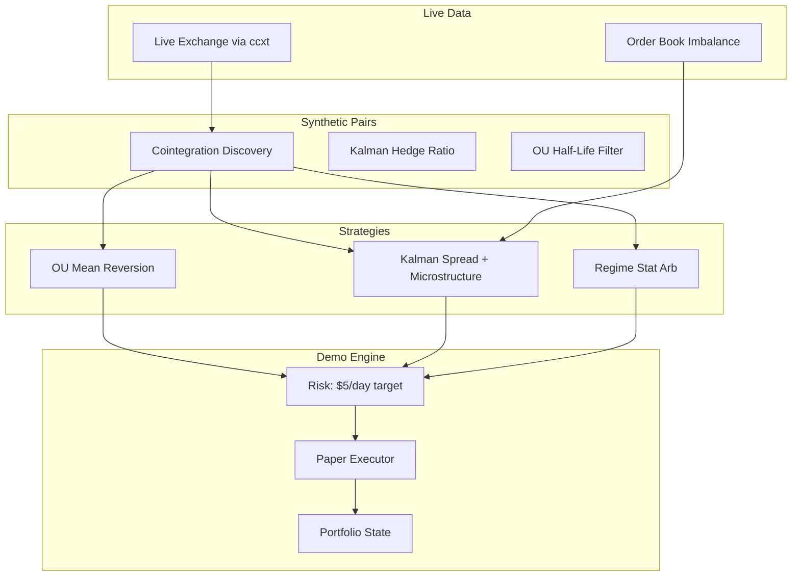

# Autonomous Daily Profit Bot

Fully autonomous **demo (paper) trading** bot targeting **$5/day profit** using **live OKX/Kraken market data** (auto-fallback), **synthetic cointegrated pairs**, and **statistical algorithms** — no RSI, MACD, EMA, or other legacy indicators.

## Architecture



## What makes this different

| Approach | This bot |
|----------|----------|
| RSI / MACD / Bollinger | **Not used** |
| Synthetic pairs | Cointegrated log-spreads (BTC/ETH, SOL/BNB, etc.) |
| Hedge ratio | Kalman filter + recursive least squares |
| Entry/exit | Ornstein-Uhlenbeck z-score, variance ratio regimes |
| Confirmation | Order book bid/ask imbalance (microstructure) |
| Execution | Paper fills at live bid/ask with slippage model |
| Risk | Stops at $5 daily profit or $15 max daily loss |

## Quick start

```bash
# Install and run (autonomous loop every 30s)
chmod +x scripts/run_bot.sh
./scripts/run_bot.sh run

# Single cycle (test)
./scripts/run_bot.sh once

# Check status
./scripts/run_bot.sh status
```

Or manually:

```bash
python3 -m venv .venv && source .venv/bin/activate
pip install -r requirements.txt
cp .env.example .env
python src/main.py run
```

## Configuration

Edit `.env`:

| Variable | Default | Description |
|----------|---------|-------------|
| `DAILY_PROFIT_TARGET_USD` | `5.0` | Stop trading when reached |
| `MAX_DAILY_LOSS_USD` | `15.0` | Halt on daily drawdown |
| `INITIAL_CAPITAL_USD` | `1000.0` | Paper account size |
| `POLL_INTERVAL_SECONDS` | `30` | Cycle frequency |
| `SYMBOLS` | `BTC/USDT,ETH/USDT,...` | Universe for pair discovery (OKB replaces BNB on OKX) |

Optional exchange API keys enable future testnet execution. **Market data works without API keys.** The bot auto-falls back across OKX → Kraken → KuCoin → Bitget if an exchange is unavailable.

## Strategies

1. **OU Mean Reversion** — Fits Ornstein-Uhlenbeck parameters (θ, μ, σ) on synthetic spreads; enters at ±2σ, exits on reversion.

2. **Kalman Spread** — Dynamic hedge ratio via Kalman/RLS; requires order book imbalance alignment before entry.

3. **Regime Stat Arb** — Variance ratio + volatility compression detects mean-reverting regimes; only trades when regime score > 0.85.

## State persistence

- `data/portfolio.json` — Open positions, realized PnL
- `data/state.json` — Daily PnL tracking (resets per calendar day)

## Disclaimer

This is **demo/paper trading only**. Past statistical edge does not guarantee future returns. Crypto markets are volatile. Use at your own risk. Not financial advice.
